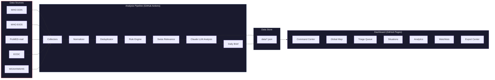

# SENTINEL

**Swiss Epidemic Notification and Threat Intelligence Engine**

> Automated global disease intelligence for Swiss public health -- serving BLV and BAG under the One Health framework.

[](https://github.com/user/sentinel/actions/workflows/ci.yml)
[](https://github.com/user/sentinel/actions/workflows/pipeline.yml)
[](LICENSE)
[](https://www.python.org/downloads/)
[](https://nextjs.org/)

---

## What is SENTINEL?

SENTINEL automatically screens global public health data sources every day and produces risk-scored, Switzerland-relevant intelligence briefs. It serves the **Swiss Federal Food Safety and Veterinary Office (BLV)** and the **Federal Office of Public Health (BAG)** under the **One Health** framework -- integrating human, animal, and environmental health surveillance into a single operational picture.

Every morning at 06:00 UTC, the pipeline collects events from five international sources, normalizes and deduplicates them, applies a hybrid risk-scoring engine (deterministic rules + Claude LLM analysis), and publishes the results to a static dashboard -- all running on GitHub Actions with zero infrastructure cost.

---

## Architecture



---

## Features

### Automated Daily Intelligence Pipeline

The pipeline runs unattended on GitHub Actions, collecting from all five sources in parallel, then processing events through an eight-stage analysis chain:

1. **Collect** -- RSS feeds (WHO DON, ProMED, ECDC), REST APIs (WOAH/WAHIS, WHO EIOS)
2. **Normalize** -- Canonical disease names (40+ aliases), ISO 3166 country codes, WHO region assignment
3. **Deduplicate** -- Cross-source merge using disease + country + 3-day window grouping
4. **Rule Engine** -- Deterministic scoring: geographic proximity, disease severity, zoonotic flags, case fatality, source authority
5. **Swiss Relevance** -- Border countries, trade partners, vector habitat, zoonotic/foodborne tags
6. **Executive Ops Layer** -- Confidence scoring, probability/impact decomposition, IMS activation level, lead authority (BAG/BLV/Joint), decision window, and action flags
7. **Decision Playbooks** -- Hazard-class assignment (pandemic respiratory, zoonotic spillover, foodborne, vector-borne), SLA timers, and escalation workflows
8. **LLM Analysis** -- Claude Haiku for bulk screening, Claude Sonnet for high-risk events. Produces structured risk narratives with Switzerland-specific recommendations

### Seven-View Dashboard

| View | Purpose |
|------|---------|
| **Command Center** | KPI cards, risk heatmap, priority events, trend sparklines |
| **Global Map** | Interactive disease event visualization with toggleable layers |
| **Triage Queue** | Card-based analyst workflow: assign, annotate, override, batch-process |
| **Situations** | Kanban board tracking evolving outbreaks across sources and time |
| **Analytics** | Disease trends, source comparison, risk timelines, geographic spread |
| **Watchlists** | Custom alert criteria with pre-built templates |
| **Export Center** | PDF, CSV, JSON, Markdown exports with agency-specific templates |

### Multi-Agency Support

| Agency | Focus | Priority Sources |
|--------|-------|------------------|
| **BLV** | Zoonoses, food safety, vector-borne, AMR, animal health | WOAH, ECDC, ProMED |
| **BAG** | Pandemics, respiratory, vaccine-preventable, travel health | WHO DON, ECDC, WHO EIOS |
| **Joint** | One Health coordination -- zoonotic spillover, AMR | All sources |

### One Health Approach

SENTINEL tags and tracks events across the human-animal-environment interface:

- **Zoonotic** -- Animal-to-human spillover potential (avian influenza, Ebola, MERS, Nipah, rabies, brucellosis, Q fever, etc.)
- **Vector-borne** -- Diseases with established or emerging vectors in Swiss climate zones (dengue, West Nile, chikungunya, Zika, bluetongue)
- **Foodborne** -- Campylobacteriosis, salmonellosis, listeriosis, E. coli linked to Swiss import chains
- **AMR** -- Antimicrobial resistance tracking (tuberculosis, campylobacter, salmonella)

---

## Data Sources

| Source | Method | Focus | One Health Domain | Update |
|--------|--------|-------|-------------------|--------|
| [WHO DON](https://www.who.int/emergencies/disease-outbreak-news) | RSS feed | Official outbreak reports | Human | Daily |
| [WHO EIOS](https://www.who.int/initiatives/eios) | REST API | Media-based epidemic intelligence | Human / Environment | Daily |
| [ProMED-mail](https://promedmail.org) | RSS feed | Early-warning expert reports | Human / Animal | Daily |
| [ECDC](https://www.ecdc.europa.eu) | RSS feed | European threat assessments | Human | Daily |
| [WOAH/WAHIS](https://wahis.woah.org) | REST API | Animal disease outbreaks globally | Animal | Daily |

Each source implements a pluggable `BaseCollector` interface. Adding a new source requires a single Python class.

---

## Quick Start

### Prerequisites

- Python 3.12+
- Node.js 20+
- [uv](https://docs.astral.sh/uv/) (Python package manager)

### 1. Clone and install

```bash
git clone https://github.com/user/sentinel.git
cd sentinel

# Backend
cd backend && uv sync --dev && cd ..

# Frontend
cd frontend && npm ci && cd ..
```

### 2. Run the pipeline

```bash
# Set your Anthropic API key (optional -- pipeline works without LLM analysis)
export SENTINEL_ANTHROPIC_API_KEY="sk-ant-..."

# Run the collection and analysis pipeline
cd backend && uv run python -m sentinel.pipeline
```

### 3. Run the dashboard

```bash
# Start development server (syncs root data/ into frontend/public/data/)
cd frontend && npm run dev
```

Open [http://localhost:3000](http://localhost:3000) to view the dashboard.

---

## Tech Stack

| Component | Technology |
|-----------|------------|
| **Backend** | Python 3.12, FastAPI, Pydantic v2, httpx, feedparser |
| **LLM** | Anthropic Claude API (Haiku 4.5 for screening, Sonnet 4.6 for deep analysis) |
| **Frontend** | Next.js 14, React 18, TypeScript |
| **Styling** | Tailwind CSS (Swiss minimalist / International Typographic Style) |
| **Charts** | Recharts, D3.js |
| **Maps** | Mapbox GL JS |
| **Testing** | pytest + pytest-asyncio (backend), Vitest (frontend) |
| **CI/CD** | GitHub Actions (CI, daily pipeline, Pages deploy) |
| **Deployment** | GitHub Pages (static export, zero cost) |

---

## Project Structure

```
sentinel/
├── .github/workflows/
│   ├── ci.yml                  # Lint, type-check, test on PRs
│   ├── pipeline.yml            # Daily data collection (06:00 UTC)
│   └── deploy-dashboard.yml    # Auto-deploy dashboard on data change
├── backend/
│   ├── pyproject.toml
│   └── sentinel/
│       ├── pipeline.py         # Orchestrates the full pipeline
│       ├── config.py           # Environment-based settings
│       ├── store.py            # JSON file-based data persistence
│       ├── collectors/         # Source-specific data collectors
│       │   ├── base.py         # BaseCollector ABC
│       │   ├── who_don.py      # WHO Disease Outbreak News
│       │   ├── who_eios.py     # WHO Epidemic Intelligence
│       │   ├── promed.py       # ProMED-mail
│       │   ├── ecdc.py         # European CDC
│       │   └── woah.py         # World Organisation for Animal Health
│       ├── analysis/           # Processing and scoring
│       │   ├── normalizer.py   # Disease name + country code normalization
│       │   ├── deduplicator.py # Cross-source event merging
│       │   ├── rule_engine.py  # Deterministic risk scoring
│       │   ├── swiss_relevance.py  # Switzerland-specific scoring
│       │   └── llm_analyzer.py # Claude-powered risk analysis
│       ├── models/             # Pydantic data models
│       │   ├── event.py        # HealthEvent (core entity)
│       │   ├── situation.py    # Situation (outbreak threading)
│       │   ├── annotation.py   # Analyst annotations
│       │   └── organization.py # BLV/BAG/Joint agency configs
│       ├── api/                # FastAPI REST endpoints
│       │   ├── events.py       # Event listing, filtering, search
│       │   ├── situations.py   # Situation CRUD and event linking
│       │   ├── annotations.py  # Analyst annotation management
│       │   ├── analytics.py    # Trend and timeline data
│       │   ├── watchlists.py   # Custom alert criteria
│       │   └── exports.py      # CSV, JSON, Markdown export
│       └── reports/            # Report generation
│           ├── daily_brief.py  # Markdown intelligence brief
│           └── csv_export.py   # Tabular data export
├── frontend/                   # Next.js 14 dashboard
│   └── src/
│       ├── app/                # Page routes
│       ├── components/ui/      # Reusable UI components
│       └── lib/                # API client, types, constants
├── data/                       # Pipeline output (git-committed)
│   ├── events/                 # Daily event JSON files
│   ├── reports/                # Daily Markdown briefs
│   ├── situations/             # Active situation tracking
│   └── annotations/            # Analyst annotations
└── docs/                       # Documentation
    ├── architecture.md
    ├── data-sources.md
    ├── risk-scoring.md
    ├── deployment.md
    ├── analyst-guide.md
    └── api-reference.md
```

---

## Risk Scoring

SENTINEL uses a **hybrid scoring approach** combining deterministic rules with LLM analysis:

1. **Rule Engine** (0--10 scale) -- Geographic proximity to Switzerland, disease severity, zoonotic/vector-borne flags, case fatality data, source authority
2. **Swiss Relevance** (0--10 scale) -- Border country proximity, trade partner status, vector habitat suitability, One Health tag relevance
3. **LLM Adjustment** -- Claude reviews events scoring >= 4.0, provides structured risk narratives, and can adjust the automated score based on epidemiological judgment

| Category | Score Range | Action |
|----------|-------------|--------|
| **CRITICAL** | 8.0 -- 10.0 | Immediate analyst review, cross-agency alert |
| **HIGH** | 6.0 -- 7.9 | Priority triage, situation creation |
| **MEDIUM** | 4.0 -- 5.9 | Standard monitoring, LLM analysis |
| **LOW** | 0.0 -- 3.9 | Logged, available for search |

Full methodology: [docs/risk-scoring.md](docs/risk-scoring.md)

---

## Configuration

All settings are controlled via environment variables with the `SENTINEL_` prefix:

| Variable | Default | Description |
|----------|---------|-------------|
| `SENTINEL_ANTHROPIC_API_KEY` | `""` | Anthropic API key for LLM analysis |
| `SENTINEL_DATA_DIR` | `data` | Pipeline output directory |
| `SENTINEL_LOG_LEVEL` | `INFO` | Logging verbosity |
| `SENTINEL_MAPBOX_TOKEN` | `""` | Mapbox GL token for map view |
| `SENTINEL_ENABLE_WHO_DON` | `true` | Toggle WHO DON collector |
| `SENTINEL_ENABLE_WHO_EIOS` | `true` | Toggle WHO EIOS collector |
| `SENTINEL_ENABLE_PROMED` | `true` | Toggle ProMED collector |
| `SENTINEL_ENABLE_ECDC` | `true` | Toggle ECDC collector |
| `SENTINEL_ENABLE_WOAH` | `true` | Toggle WOAH collector |

---

## Documentation

| Document | Description |
|----------|-------------|
| [Architecture](docs/architecture.md) | System design, data flow, component interactions, design decisions |
| [Data Sources](docs/data-sources.md) | Per-source details: URLs, formats, rate limits, error handling |
| [Risk Scoring](docs/risk-scoring.md) | Full methodology with weights, LLM prompts, and worked examples |
| [Deployment](docs/deployment.md) | Step-by-step: fork, secrets, Actions, Pages |
| [Analyst Guide](docs/analyst-guide.md) | User manual for BLV/BAG analysts |
| [API Reference](docs/api-reference.md) | Every endpoint with request/response examples |
| [Contributing](CONTRIBUTING.md) | How to add sources, code standards, PR process |

---

## Contributing

See [CONTRIBUTING.md](CONTRIBUTING.md) for guidelines on adding new data sources, code standards, and the PR process.

---

## License

MIT -- see [LICENSE](LICENSE) for details.

---

## Acknowledgments

- **Swiss Federal Food Safety and Veterinary Office (BLV)** -- Animal health, food safety, and zoonotic disease mandate
- **Swiss Federal Office of Public Health (BAG)** -- Human health and pandemic preparedness mandate
- **One Health** approach championed by WHO, WOAH (OIE), and FAO -- recognizing that the health of humans, animals, and the environment are interconnected
