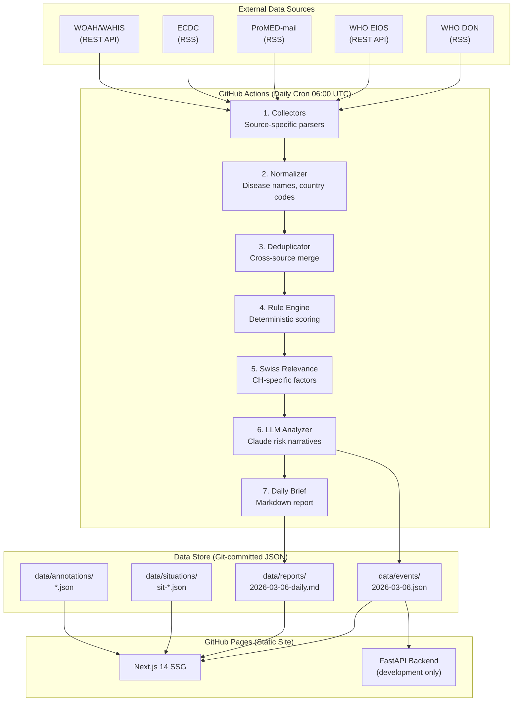
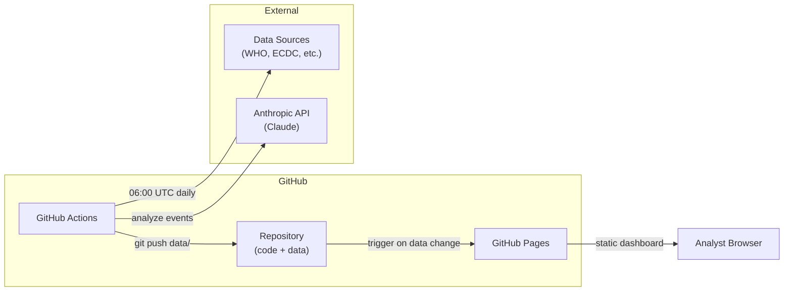

# Architecture

SENTINEL is a fully automated public health intelligence system. This document describes the system design, data flow, component interactions, and the rationale behind key design decisions.

---

## System Overview



---

## Pipeline Data Flow

The pipeline runs as a single async Python process, orchestrated by `pipeline.py`. Each stage transforms the event list in sequence:

### Stage 1: Collection

Each enabled collector fetches data from its source using `httpx.AsyncClient` with a 30-second timeout. Collectors return `list[HealthEvent]` and must never raise exceptions -- failures are caught, logged, and the pipeline continues with partial data.

**File:** `backend/sentinel/collectors/`

### Stage 2: Normalization

The normalizer applies two transformations to every event:

- **Disease names** -- Maps 40+ aliases to canonical names (e.g., "bird flu", "avian flu", "H5N1" all map to specific canonical forms)
- **Country codes** -- Converts country names to ISO 3166 alpha-2 codes using a dictionary of 100+ mappings
- **WHO regions** -- Assigns WHO regional office codes (AFRO, AMRO, EURO, etc.) based on country codes

**File:** `backend/sentinel/analysis/normalizer.py`

### Stage 3: Deduplication

Events from different sources describing the same outbreak are merged. The deduplicator groups events by `disease + sorted countries` key, then checks for date proximity within a 3-day window. When duplicates are found:

- The highest-priority source (ECDC > WHO DON > WOAH > ProMED > EIOS) becomes the primary record
- The longest summary is kept
- Country lists are unioned
- The highest case/death counts are preserved

**File:** `backend/sentinel/analysis/deduplicator.py`

### Stage 4: Rule Engine

Deterministic scoring on a 0--10 scale. Each event accumulates points based on:

| Factor | Points | Condition |
|--------|--------|-----------|
| Swiss event | +4.0 | Event in Switzerland |
| Border country | +3.0 | DE, FR, IT, AT, LI |
| Trade partner | +1.5 | NL, BE, ES, US, CN, BR, GB, PL |
| High-concern disease | +2.5 | 18 diseases on the watch list |
| Zoonotic/both species | +1.0 | Species = BOTH or disease in zoonotic set |
| Deaths > 10 | +2.0 | Significant mortality |
| Deaths > 0 | +1.0 | Any reported deaths |
| Cases > 100 | +1.0 | Significant case count (if no deaths) |
| Authoritative source | +1.0 | ECDC or WHO DON |

Score is capped at 10.0.

**File:** `backend/sentinel/analysis/rule_engine.py`

### Stage 5: Swiss Relevance

A separate 0--10 score measuring how directly relevant an event is to Switzerland:

| Factor | Points | Condition |
|--------|--------|-----------|
| Swiss event | 10.0 | Direct -- event in CH |
| Border country | +5.0 | DE, FR, IT, AT, LI |
| European country | +2.5 | 27 European countries |
| Trade partner | +2.0 | Major Swiss import/export partners |
| CH vector disease | +2.0 | Diseases with vectors established in Switzerland |
| Zoonotic tag | +1.5 | Relevant for BLV mandate |
| Foodborne tag | +1.5 | Relevant for BLV food safety mandate |
| High case count | +1.0 | > 1000 cases |

**File:** `backend/sentinel/analysis/swiss_relevance.py`

### Stage 6: LLM Analysis

Events scoring >= 4.0 (MEDIUM or above) are sent to Claude for structured analysis. The model selection is automatic:

- **Claude Haiku 4.5** for events with risk score < 6.0 (cost-efficient bulk screening)
- **Claude Sonnet 4.6** for events with risk score >= 6.0 (deep analysis of high-risk events)

The LLM produces a structured JSON response containing:
- Risk assessment narrative
- Switzerland-specific relevance explanation
- One Health cross-domain analysis
- Recommended actions for Swiss authorities
- Adjusted risk score (can override the automated score)

**File:** `backend/sentinel/analysis/llm_analyzer.py`

### Stage 7: Persistence and Reporting

- Events are serialized to `data/events/YYYY-MM-DD.json`
- A Markdown daily brief is generated and saved to `data/reports/YYYY-MM-DD-daily.md`
- The pipeline commits new data to the repository, triggering the dashboard rebuild

**Files:** `backend/sentinel/store.py`, `backend/sentinel/reports/daily_brief.py`

---

## Component Interactions

### Backend Components

```
pipeline.py
    ├── collectors/ -----> models/event.py (HealthEvent)
    ├── analysis/
    │   ├── normalizer.py
    │   ├── deduplicator.py
    │   ├── rule_engine.py
    │   ├── swiss_relevance.py
    │   └── llm_analyzer.py ---> Anthropic Claude API
    ├── reports/
    │   └── daily_brief.py
    └── store.py ---------> data/*.json
```

### API Layer

The FastAPI application (`main.py`) provides a REST API for the frontend during development. In production (GitHub Pages), the frontend reads directly from static JSON files.

```
main.py
    ├── api/events.py       --> GET /api/events, /api/events/latest, /api/events/stats, /api/events/{id}
    ├── api/situations.py   --> CRUD /api/situations
    ├── api/annotations.py  --> POST/GET /api/annotations
    ├── api/analytics.py    --> GET /api/analytics/trends, /sources, /risk-timeline
    ├── api/watchlists.py   --> CRUD /api/watchlists
    └── api/exports.py      --> POST /api/exports/csv, /json; GET /api/exports/reports/{date}
```

### Frontend

The Next.js 14 dashboard reads JSON data from `public/data/` at build time (static generation) and renders seven views. UI components follow the Swiss minimalist design language with a dark theme.

---

## Design Decisions

### Why JSON files instead of a database?

**Decision:** All pipeline state is stored as JSON files committed to the git repository.

**Rationale:**
- **Zero infrastructure** -- No database server to provision, maintain, or pay for
- **Full audit trail** -- Git history provides a complete, immutable record of every data change
- **Portability** -- Clone the repo and you have the entire system, data included
- **GitHub Actions compatibility** -- The pipeline runs in ephemeral CI environments; file-based storage works naturally with `git add && git commit && git push`
- **Sufficient for scale** -- At 5 sources with ~20 events each per day, daily JSON files remain small (< 100KB)

**Tradeoff:** No complex queries, no concurrent writes. For production scaling beyond ~1000 events/day, migration to SQLite or PostgreSQL would be straightforward since all data access goes through the `DataStore` abstraction.

### Why static site export (SSG) instead of server-side rendering?

**Decision:** The dashboard is a Next.js static export deployed to GitHub Pages.

**Rationale:**
- **Zero hosting cost** -- GitHub Pages is free for public repositories
- **No server to manage** -- No Node.js runtime, no scaling, no uptime concerns
- **Fast globally** -- Static files served from GitHub's CDN
- **Data freshness is acceptable** -- Dashboard rebuilds automatically when the pipeline commits new data (typically once daily)

**Tradeoff:** No server-side API calls from the dashboard in production. Analyst annotations in the PoC use `localStorage` with JSON export/import. A production deployment would add a lightweight API backend.

### Why hybrid scoring (rules + LLM)?

**Decision:** Events are first scored by a deterministic rule engine, then high-scoring events get LLM analysis.

**Rationale:**
- **Determinism** -- The rule engine is transparent, auditable, and reproducible. Analysts can understand exactly why an event received its score
- **Cost efficiency** -- LLM analysis only runs on events scoring >= 4.0 (roughly the top 40%), keeping API costs proportional to signal, not noise
- **Expert nuance** -- The LLM adds epidemiological judgment that rule-based systems cannot: historical context, cross-domain implications, Switzerland-specific reasoning
- **Graceful degradation** -- If the LLM API is unavailable, the pipeline still produces fully scored events with rule-based analysis

### Why separate risk score and Swiss relevance?

**Decision:** Two independent scores rather than a single combined score.

**Rationale:**
- **Different questions** -- Risk score answers "How dangerous is this event globally?" while Swiss relevance answers "How much does this matter to Switzerland specifically?"
- **Analyst flexibility** -- An analyst tracking a global outbreak (high risk, low Swiss relevance) has different needs than one monitoring a nearby food safety issue (moderate risk, high Swiss relevance)
- **Agency-specific views** -- BLV and BAG can sort/filter on the dimension most relevant to their mandate

---

## Data Models

### Core Entity: HealthEvent

The `HealthEvent` model is the central data structure. It carries raw data from collection through every analysis stage:

```python
class HealthEvent(BaseModel):
    id: str                         # SHA-256 hash (disease|countries|date|source)
    source: Source                  # WHO_DON | WHO_EIOS | PROMED | ECDC | WOAH
    title: str
    date_reported: date
    date_collected: date
    disease: str                    # Normalized canonical name
    pathogen: str | None
    countries: list[str]            # ISO 3166 alpha-2
    regions: list[str]              # WHO regions
    species: Species                # human | animal | both
    case_count: int | None
    death_count: int | None
    summary: str
    url: str
    raw_content: str

    # Analysis output
    risk_score: float               # 0-10
    swiss_relevance: float          # 0-10
    risk_category: RiskCategory     # CRITICAL | HIGH | MEDIUM | LOW
    one_health_tags: list[str]      # zoonotic, vector-borne, foodborne, AMR
    analysis: str                   # LLM-generated narrative
```

### Supporting Models

- **Situation** -- Groups related events into an evolving outbreak narrative (Kanban status, priority, multi-agency impact assessment)
- **Annotation** -- Analyst notes, assessments, risk overrides, and status changes on events
- **Organization** -- Agency configuration (BLV, BAG, Joint) with domain focus and source priorities

---

## Deployment Architecture



The entire system runs on GitHub infrastructure:
1. **GitHub Actions** runs the pipeline on a daily cron schedule
2. Pipeline output is committed to the repository
3. Data changes trigger the dashboard build-and-deploy workflow
4. **GitHub Pages** serves the static dashboard globally

No servers, no databases, no cloud accounts beyond GitHub and Anthropic.
